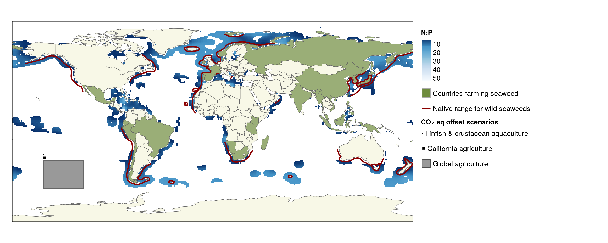

Interact with spatial data in R using `mapview` and `mapedit`
========================================================
author: Jamie Montgomery
date: February 4 2020
autosize: true

Motivation
========================================================

R has become even better at spatial analysis with development of the `sf`, `raster`, `stars` and other packages. 
<blockquote class="twitter-tweet">
Yes, you can do <a href="https://twitter.com/hashtag/geospatial?src=hash&amp;ref_src=twsrc%5Etfw">#geospatial</a> in R! Some popular <a href="https://twitter.com/hashtag/rspatial?src=hash&amp;ref_src=twsrc%5Etfw">#rspatial</a> packages: sf, raster, ggplot2. (And there&#39;s Python and QGIS too, of course.) <a href="https://twitter.com/hashtag/rstudioconf?src=hash&amp;ref_src=twsrc%5Etfw">#rstudioconf</a> <a href="https://twitter.com/TinaACormier?ref_src=twsrc%5Etfw">@TinaACormier</a>. <a href="https://t.co/KFKzcHhu8H">pic.twitter.com/KFKzcHhu8H</a>
&mdash; Pamela Reynolds (@PLNReynolds) <a href="https://twitter.com/PLNReynolds/status/1222682272450650125?ref_src=twsrc%5Etfw">January 30, 2020</a></blockquote> 

But what about interacting with my data??
========================================================

 
Basic plotting of spatial data, even with `ggplot`, doesn't let you get a feel for what's going on with your spatial data.

I found myself using ArcGIS/QGIS when wanting to zoom in and explore my data.

With `mapview` this is no longer necessary! 

<iframe src="https://giphy.com/embed/12UlfHpF05ielO" width="480" height="273" frameBorder="0" class="giphy-embed" allowFullScreen></iframe>
<a href="https://giphy.com/gifs/excited-seinfeld-12UlfHpF05ielO">via GIPHY</a>

...and editing my spatial data??
========================================================

 

AKA deleting, adding, editing individual features of a spatial file (usually vectors) is possible with `mapedit`

I have really only found the need to do this once, for a [paper on seaweed aquaculture potential](https://www.sciencedirect.com/science/article/abs/pii/S0960982219308863).

All red lines indicating native ranges for seaweed were hand drawn by yours truly using `mapedit`.

